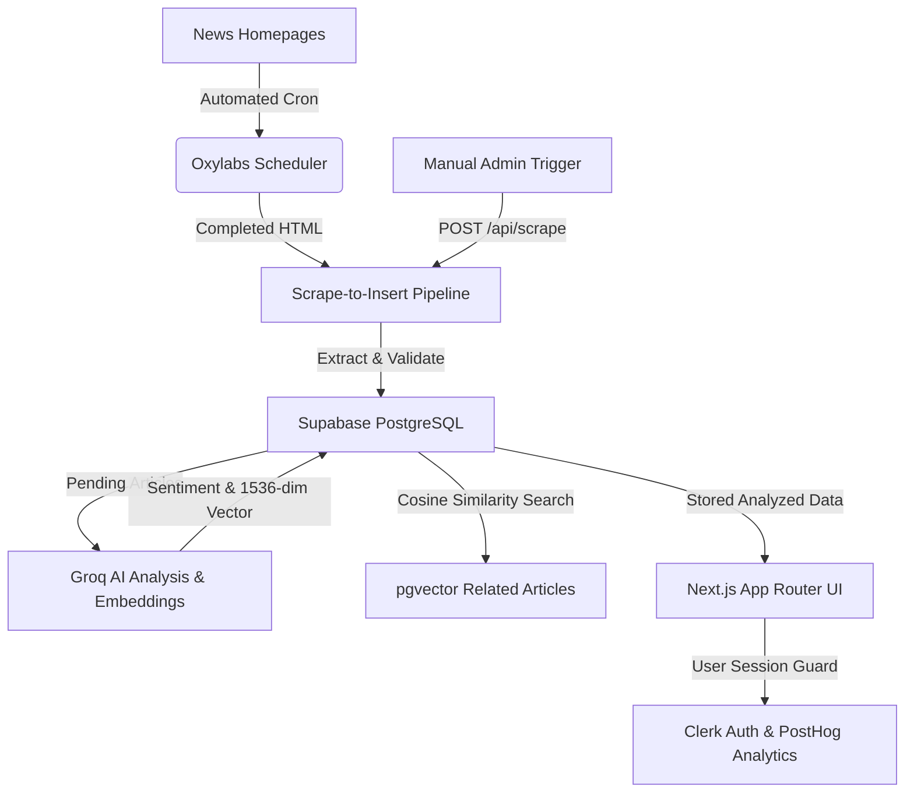

# 📰 biasly — AI-Powered News Sentiment & Framing Analysis Platform

[](https://fullstackaiwebsitewithagents.vercel.app)
[](https://nextjs.org/)
[](https://react.dev/)
[](https://supabase.com/)
[](https://groq.com/)
[](https://clerk.com/)
[](https://posthog.com/)

**biasly** collects real-time news articles from configured international news sources (Reuters, BBC News, Fox News, CNN, The Guardian, NPR), analyzes them with artificial intelligence, stores them in Supabase, and displays reader-friendly sentiment and political framing insights.

---

## 🌐 Live URLs

- **Live Production App**: **[https://fullstackaiwebsitewithagents.vercel.app](https://fullstackaiwebsitewithagents.vercel.app)**
- **GitHub Repository**: **[https://github.com/Juggernaut576/biasly](https://github.com/Juggernaut576/biasly)**

---

## ✨ Features

- **📰 Multi-Source News Aggregation**: Automated scraping using the Oxylabs Web Scraper API across major global publications with automatic anti-bot bypass and strict content-gate validation.
- **🤖 High-Speed AI Analysis**: Powered by Groq Llama 3.3 70B via Vercel AI SDK (`@ai-sdk/groq`) to deliver neutral summaries, sentiment scores, political framing percentages (Left / Center / Right), loaded terms, and framing notes.
- **🧠 pgvector Similarity Search**: Generates 1536-dimensional vector embeddings for cosine similarity distance matching to display related news coverage across different outlets.
- **🔐 Protected Article Access**: Visitors can browse headline news cards on the public homepage (`/`), while full article content and AI framing analysis (`/article/*`) are strictly protected and require Clerk authentication.
- **⏱️ Automated Pipeline**: Oxylabs Scheduler paired with Vercel Cron (`vercel.json`) to scrape homepages and analyze new articles automatically.
- **📊 Integrated Telemetry**: Privacy-first pageview and event analytics powered by PostHog (`posthog-js`).
- **🎨 Modern Responsive UI**: Built with Next.js 16 App Router, Tailwind CSS, Poppins typography, and custom micro-animations.

---

## 🛠️ Tech Stack

| Layer | Technology |
| :--- | :--- |
| **Deployment** | [Vercel](https://vercel.com/) |
| **Framework** | [Next.js 16 (App Router)](https://nextjs.org/) |
| **Language** | [TypeScript](https://www.typescriptlang.org/) |
| **Styling** | [Tailwind CSS v4](https://tailwindcss.com/) & [Lucide Icons](https://lucide.dev/) |
| **Authentication** | [Clerk](https://clerk.com/) |
| **Database & Vector** | [Supabase PostgreSQL](https://supabase.com/) with [`pgvector`](https://github.com/pgvector/pgvector) extension |
| **Scraping Engine** | [Oxylabs Web Scraper API](https://oxylabs.io/) & Oxylabs Scheduler |
| **AI Text Engine** | [Vercel AI SDK](https://sdk.vercel.ai/) & [Groq Llama 3.3 70B](https://groq.com/) |
| **Cron Scheduling** | [Vercel Cron](https://vercel.com/docs/cron-jobs) |
| **Analytics** | [PostHog](https://posthog.com/) |

---

## 🏛️ System Architecture



---

## 🗄️ Database Schema (`public`)

- **`sources`**: Active news outlets (Reuters, BBC, Fox, CNN, Guardian, NPR) with listing URLs and logos.
- **`articles`**: Append-only scraped news articles with original URLs, titles, image URLs, published dates, and raw text.
- **`article_analyses`**: AI analysis output (neutral summary, sentiment score, Left/Center/Right percentages, bias label, confidence, framing notes, loaded terms, disclaimer, and `vector(1536)` embedding).
- **`oxylabs_schedules`**: Synced Oxylabs schedule IDs and status.
- **`oxylabs_schedule_runs`**: Execution log of processed Oxylabs jobs.
- **`logs`**: Centralized pipeline execution and error log system.

---

## 🚀 Getting Started

### 1. Prerequisites
- Node.js `>= 18.x`
- npm `>= 9.x`

### 2. Installation

Clone the repository and install dependencies:

```bash
git clone https://github.com/Juggernaut576/biasly.git
cd biasly
npm install
```

### 3. Environment Variables

Create a `.env.local` file in the project root:

```env
# Clerk Authentication
NEXT_PUBLIC_CLERK_PUBLISHABLE_KEY=pk_test_...
CLERK_SECRET_KEY=sk_test_...
NEXT_PUBLIC_CLERK_SIGN_IN_URL=/sign-in
NEXT_PUBLIC_CLERK_SIGN_UP_URL=/sign-up

# Supabase
NEXT_PUBLIC_SUPABASE_URL=https://<your-project>.supabase.co
NEXT_PUBLIC_SUPABASE_ANON_KEY=sb_publishable_...
SUPABASE_SERVICE_ROLE_KEY=sb_secret_...

# Oxylabs Credentials
OXY_WSA_USERNAME=your_oxylabs_username
OXY_WSA_PASSWORD=your_oxylabs_password

# Admin API Header Secret
BIASLY_ADMIN_SECRET=your_admin_secret_here

# Groq AI SDK
GROQ_API_KEY=gsk_...

# PostHog Analytics
NEXT_PUBLIC_POSTHOG_KEY=phc_...
NEXT_PUBLIC_POSTHOG_HOST=https://us.i.posthog.com
```

### 4. Database Setup

Apply the schema located at [`supabase/schema.sql`](supabase/schema.sql) and seed data at [`supabase/seed.sql`](supabase/seed.sql) in your Supabase SQL Editor.

### 5. Running Locally

Start the Next.js development server:

```bash
npm run dev
```

Open [http://localhost:3000](http://localhost:3000) in your browser.

---

## 🔌 API Endpoints

All write/action endpoints require the `x-biasly-admin-secret` request header matching `BIASLY_ADMIN_SECRET`.

| Method | Endpoint | Description |
| :--- | :--- | :--- |
| `POST` | `/api/scrape` | Trigger manual news scraping pipeline |
| `POST` | `/api/analyze` | Trigger AI analysis & embedding generation for pending articles |
| `POST` | `/api/oxylabs/schedules` | Sync active sources to Oxylabs Scheduler & deactivate orphans |
| `GET` | `/api/oxylabs/schedules` | List stored Oxylabs schedule rows |
| `POST` | `/api/oxylabs/scheduled-results/process` | Process completed scheduled homepage job results |
| `GET` | `/api/oxylabs/runs` | Fetch recent schedule run logs |
| `GET` | `/api/cron/pipeline` | Internal Vercel Cron route (executes scraping + AI analysis) |

---

## 📄 License

This project is licensed under the [MIT License](LICENSE).
